# CHENTHURR C K

<p align="center">
  
</p>

<p align="center">
  
  
  
</p>

---

## 👋 HELLO, I'M CHENTHURR

<p align="center">
  <a href="https://chenthurrck-portfolio.netlify.app">🌐 <strong>My Portfolio</strong></a>
</p>

I'm a final-year **B.Tech Artificial Intelligence & Data Science** student focused on building practical systems across **machine learning, computer vision, data engineering, and full-stack AI applications**.

```text
RAW DATA
    ↓
DATA PIPELINE
    ↓
INTELLIGENT MODEL
    ↓
API / APPLICATION
    ↓
REAL-WORLD IMPACT
```

------

## ⚡ WHAT I WORK ON

| Area | Focus |
|---|---|
| 🤖 AI / ML | Classification, predictive modeling, model evaluation |
| 👁️ Computer Vision | YOLOv8, OpenCV, ROI detection, tracking |
| 🧱 Data Engineering | SQL, preprocessing, feature engineering, ML pipelines |
| ⚙️ AI Applications | FastAPI, React.js, full-stack intelligent systems |
| 📊 Analytics | Power BI, Matplotlib, statistical analysis |

---

## 🧰 TECH STACK

**Languages**


**AI / Data**


**Development**


---

## 🚀 SELECTED PROJECTS

### 👁️ Real-Time Computer Vision Queue Management
YOLOv8 + OpenCV + FastAPI for real-time detection, tracking, ROI logic, and queue counting.

### 🏦 Loan Approval Prediction
ML pipeline using SQL, feature engineering, cross-validation, and model tuning for loan classification.

### 🌐 HEFIN — Decentralised AI Finance & Healthcare
AI fraud detection platform combining ICP, Motoko, React.js, and machine learning.

### 🐞 PyDebugger
Python CLI debugging utility for error detection, logging, and script analysis.

---

## 💼 EXPERIENCE

### Data Science Intern — Grom Your Skills
**Jun 2025 – Jul 2025** · Predictive modeling, SQL, feature engineering, and ML pipelines.

### Core Python Trainee — VEI Technologies
**Jan 2026 – Feb 2026** · Python, debugging utilities, data structures, and algorithms.

---

## 🏆 ACHIEVEMENTS

- 🥇 Finalist — Pathway AI Hackathon, IIT Ropar
- 🌐 Regional Round — World Computer Hacker League
- 🎤 Event Coordinator — Project Expo

---

## 📜 CERTIFICATIONS

- Introduction to Cloud Computing — NPTEL
- Advanced Microsoft Power BI — Coursera
- Explore Machine Learning using Python — Infosys SpringBoard
- AWS Cloud Practitioner Essentials — AWS Skill Builder

---

## 🐍 CONTRIBUTION SNAKE

<p align="center">
  <picture>
    <source media="(prefers-color-scheme: dark)" srcset="https://raw.githubusercontent.com/Chenthurr/Chenthurr/output/github-contribution-grid-snake-dark.svg">
    <source media="(prefers-color-scheme: light)" srcset="https://raw.githubusercontent.com/Chenthurr/Chenthurr/output/github-contribution-grid-snake.svg">
    
  </picture>
</p>

---

## 📊 GITHUB PULSE

<p align="center">
  
  
</p>

<p align="center">
  
</p>

---

## 📈 MY BUILD LOOP

```text
LEARN
  ↓
BUILD
  ↓
MEASURE
  ↓
REFINE
  ↓
SHIP
  ↓
REPEAT
```

**AI • DATA • COMPUTER VISION • ENGINEERING**

---

## 🤝 CONNECT

<p align="center">
  <a href="https://github.com/Chenthurr">
    
  </a>
  <a href="https://linkedin.com/in/chenthurr-c-k-901ab0289">
    
  </a>
  <a href="mailto:pchenthurr@gmail.com">
    
  </a>
</p>
